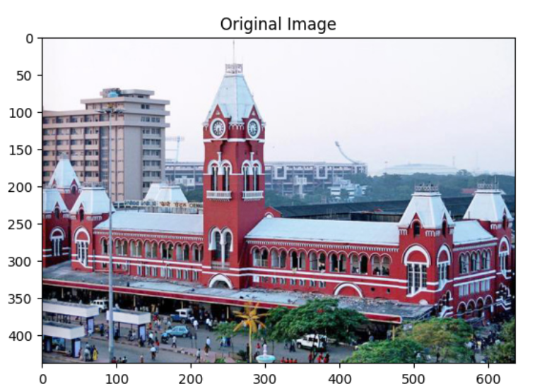
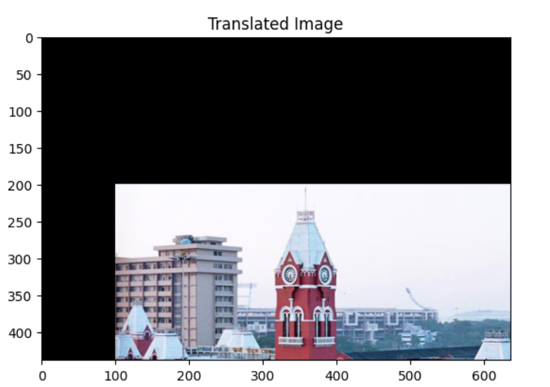
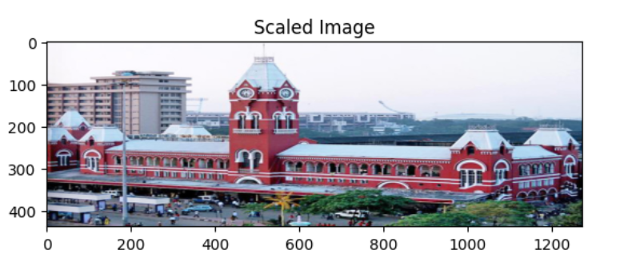
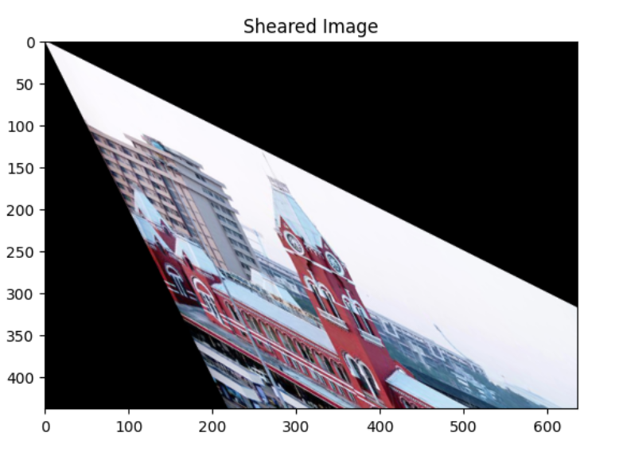
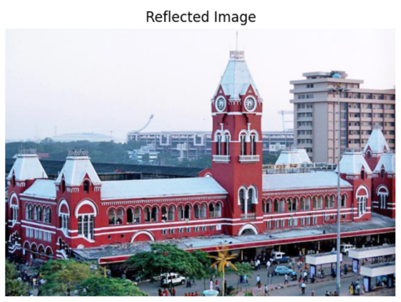
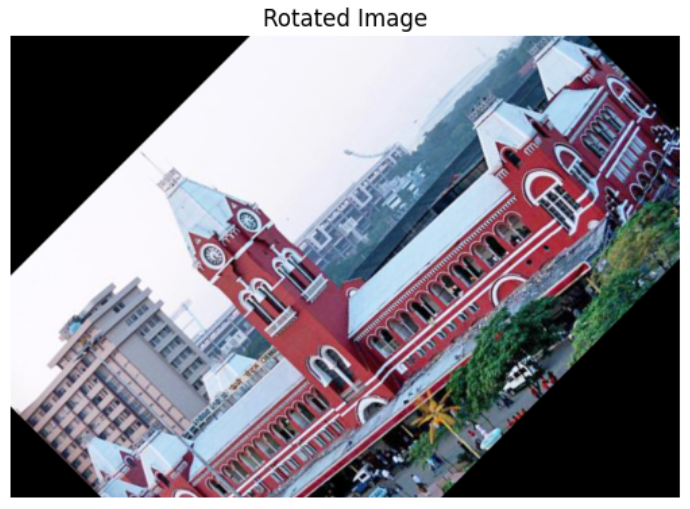
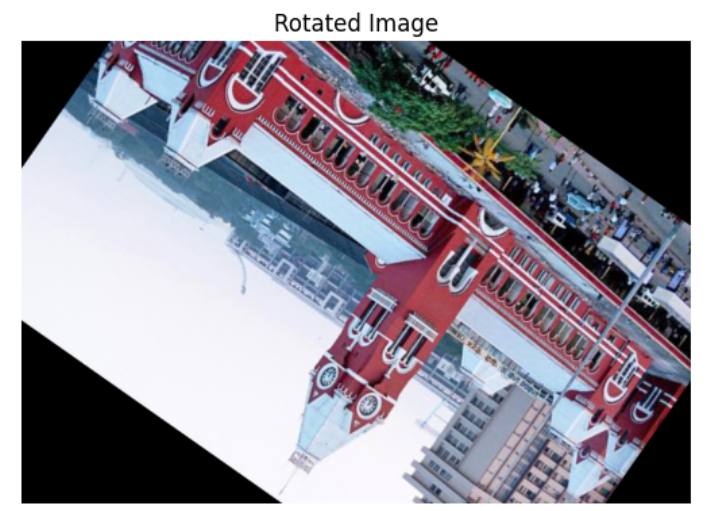
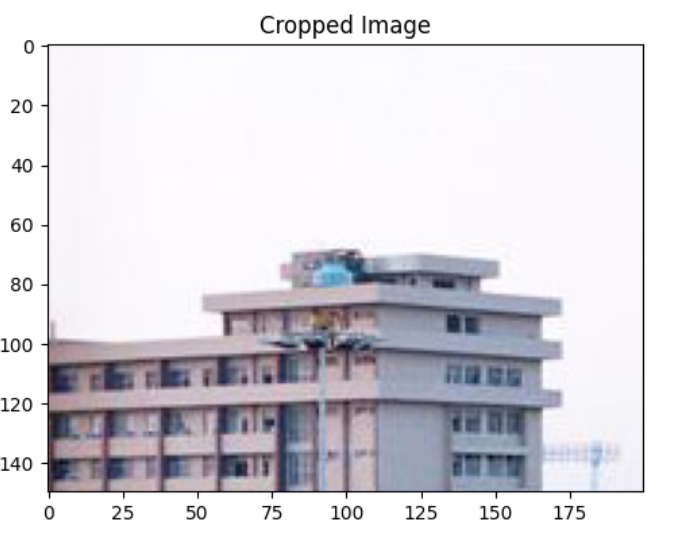

# IMAGE-TRANSFORMATIONS


## Aim
To perform image transformation such as Translation, Scaling, Shearing, Reflection, Rotation and Cropping using OpenCV and Python.

## Software Required:
Anaconda - Python 3.7

## Algorithm:
### Step1:
Import necessary libraries such as OpenCV, NumPy, and Matplotlib for image processing and visualization.
<br>

### Step2:
Read the input image using cv2.imread() and store it in a variable for further processing.
<br>

### Step3:
Apply various transformations like translation, scaling, shearing, reflection, rotation, and cropping by defining corresponding functions:

1.Translation moves the image along the x or y-axis. 2.Scaling resizes the image by scaling factors. 3.Shearing distorts the image along one axis. 4.Reflection flips the image horizontally or vertically. 5.Rotation rotates the image by a given angle.
<br>

### Step4:
Display the transformed images using Matplotlib for visualization. Convert the BGR image to RGB format to ensure proper color representation.
<br>

### Step5:
Save or display the final transformed images for analysis and use plt.show() to display them inline in Jupyter or compatible environments.
<br>

## Program:
```python
Developed By    : SANJAY M
Register Number : 212223230187
i)Image Translation
import cv2
import numpy as np
import matplotlib.pyplot as plt
image = cv2.imread('ChennaiCentral.jpg')
image.shape
# Display the images.
plt.imshow(image[:,:,::-1])
plt.title('Original Image')
plt.show()

# i) Image Translation
tx, ty = 100, 200  # Translation factors (shift by 100 pixels horizontally and 50 vertically)
M_translation = np.float32([[1, 0, tx], [0, 1, ty]])  # Translation matrix: 
# [1, 0, tx] - Horizontal shift by tx
# [0, 1, ty] - Vertical shift by ty
translated_image = cv2.warpAffine(image, M_translation, (636, 438)) 
plt.imshow(translated_image[:,:,::-1])
plt.title("Translated Image")
plt.axis('on')
plt.show()


ii) Image Scaling
# Image Scaling
fx, fy = 2.0, 1.0  
scaled_image = cv2.resize(image, None, fx=fx, fy=fy, interpolation=cv2.INTER_LINEAR)
plt.imshow(scaled_image[:,:,::-1]) 
plt.title("Scaled Image") 
plt.axis('on')
plt.show()


iii)Image shearing
# Image Shearing
shear_matrix = np.float32([[1, 0.5, 0], [0.5, 1, 0]])  
sheared_image = cv2.warpAffine(image, shear_matrix, (636, 438))
plt.imshow(sheared_image[:,:,::-1])
plt.title("Sheared Image") 
plt.axis('on')
plt.show()

iv)Image Reflection
# Image Reflection
reflected_image = cv2.flip(image, 2)  # Flip the image horizontally (1 means horizontal flip)

# flip: 1 means horizontal flip, 0 would be vertical flip, -1 would flip both axes
# Show original image 
plt.figure(figsize=(10, 5))

plt.subplot(1, 2, 1)
plt.imshow(image[:, :, ::-1])
plt.title("Original Image")
plt.axis('off')

# Show reflected image 
plt.subplot(1, 2, 2)
plt.imshow(reflected_image[:,:,::-1])
plt.title("Reflected Image")
plt.axis('off')

plt.tight_layout()
plt.show()


v)Image Rotation
# Image Rotation
(height, width) = image.shape[:2]  # Get the image height and width
angle = 45  # Rotation angle in degrees (rotate by 45 degrees)
center = (width // 2, height // 2)  # Set the center of rotation to the image center
M_rotation = cv2.getRotationMatrix2D(center, angle, 1)  # Get the rotation matrix
# getRotationMatrix2D: Takes the center of rotation, angle, and scale factor (1 means no scaling)
rotated_image = cv2.warpAffine(image, M_rotation, (width, height))  # Apply rotation
plt.imshow(cv2.cvtColor(rotated_image, cv2.COLOR_BGR2RGB))  # Display the rotated image
plt.title("Rotated Image")  # Set title
plt.axis('off')
# Image Rotation
image .shape    # height, width, channel 
angle = 145  
center = (636 // 2, 438 // 2)  
M_rotation = cv2.getRotationMatrix2D(center, angle, 1)  
# getRotationMatrix2D: Takes the center of rotation, angle, and scale factor (1 means no scaling)
rotated_image = cv2.warpAffine(image, M_rotation, (width, height)) 
plt.imshow(rotated_image[:,:,::-1])  # Display the rotated image
plt.title("Rotated Image")  # Set title
plt.axis('off')
plt.show()


vi)Image Cropping
# Image Cropping
x, y, w, h = 0, 0, 200, 150  

cropped_image = image[y:y+h, x:x+w]   # Format: image[start_row:end_row, start_col:end_col]
# Show original image 
plt.figure(figsize=(10, 5))

plt.subplot(1, 2, 1)
plt.imshow(image[:, :, ::-1])
plt.title("Original Image")
plt.axis('on')

# Show reflected image 
plt.subplot(1, 2, 2)
plt.imshow(cropped_image[:,:,::-1])
plt.title("Cropped Image")
plt.axis('on')

plt.tight_layout()
plt.show()


```
## Output:

### Original Image:


### i)Image Translation

<br>
<br>
<br>
<br>

### ii) Image Scaling

<br>
<br>
<br>
<br>


### iii)Image shearing

<br>
<br>
<br>
<br>


### iv)Image Reflection

<br>
<br>
<br>
<br>


### v)Image Rotation


<br>
<br>
<br>
<br>


### vi)Image Cropping

<br>
<br>
<br>
<br>


## Result: 

Thus the different image transformations such as Translation, Scaling, Shearing, Reflection, Rotation and Cropping are done using OpenCV and python programming.
